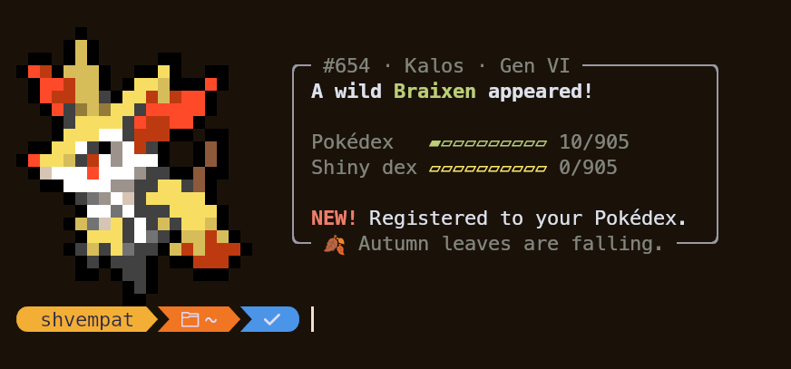
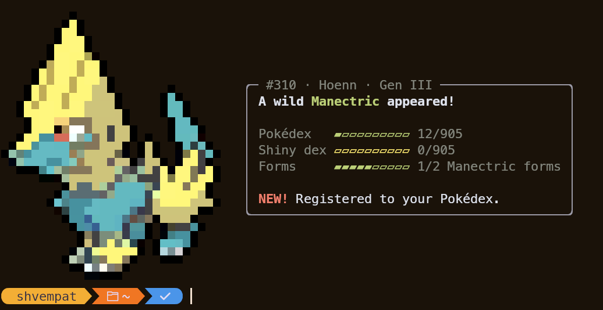

# pokegreet

A wild Pokémon appears every time you open a terminal, and you're catching 'em all whether you like it or not.

<p align="center">
  
  
</p>

Built on the sprites from [pokemon-colorscripts](https://gitlab.com/phoneybadger/pokemon-colorscripts). It adds:

- **A Pokédex.** Every encounter is recorded, so you get a species count, a NEW! tag on first sightings, and progress by region.
- **Shinies.** 1 in 128 encounters, with their own shiny dex.
- **Form collections.** Alternate forms (Alolan Vulpix, Rotom appliances, 80 flavours of Alcremie…) are tracked per species.
- **Seasons and events.** The calendar and the clock change what you run into (see below).
- **Your birthday.** Every encounter that day is shiny.

## Install

You need **Python 3.9+** (3.11+ if you want a config file) and **[pokemon-colorscripts](https://gitlab.com/phoneybadger/pokemon-colorscripts)**:

```sh
git clone https://gitlab.com/phoneybadger/pokemon-colorscripts.git
cd pokemon-colorscripts && sudo ./install.sh
# Arch: yay -S pokemon-colorscripts-git
```

Then install pokegreet:

```sh
curl -fsSL https://raw.githubusercontent.com/HalfPast9/pokegreet/main/install.sh | sh
```

This puts `pokegreet` in `~/.local/bin` and adds a line to your `.bashrc`, `.zshrc` or fish `config.fish` so it runs in every new interactive shell. Set `POKEGREET_NO_RC=1` to skip the shell part, or `POKEGREET_BIN_DIR=...` to install somewhere else.

<details>
<summary>Manual install</summary>

```sh
git clone https://github.com/HalfPast9/pokegreet.git
cp pokegreet/pokegreet ~/.local/bin/
```

Then add one line to your shell startup file:

```sh
pokegreet                                        # ~/.bashrc or ~/.zshrc
status is-interactive; and pokegreet             # ~/.config/fish/config.fish
```

If you were already running `pokemon-colorscripts -r` on startup, remove that line.
</details>

## Usage

```
pokegreet                 random encounter (this is what runs on startup)
pokegreet --dex           Pokédex, shiny dex, regional progress and form collections
pokegreet --dex rotom     form-by-form progress for one species
pokegreet --at 2026-10-31T23:00   preview what an encounter looks like then (not saved)
pokegreet --styles        the same encounter in every display style
pokegreet --check         check the theme pools against your installed sprites
```

## Seasons, events and themes

Most of the time, any of the 905 Pokémon can appear. A theme takes over some encounters on top of that, so themed Pokémon become several times more likely without crowding out everything else.

**Seasons** (1 in 8, by real-world season, and the hemisphere is configurable)

| | Who shows up |
|---|---|
| Winter | Ice types, penguins, Snorlax hibernating, Alolan and Galarian ice forms, Cyndaquil by the fire |
| Spring | Flowers, butterflies, bees, rain frogs, Easter bunnies and eggs |
| Summer | Beach and ocean Pokémon, desert dwellers, fireflies and cicadas, Oricorio |
| Autumn | Falling leaves, mushrooms, harvest, crows, sweater-sheep, cozy candles and tea |

**Themes** (1 in 6 while active)

| | When | Who shows up |
|---|---|---|
| Spooky season | October | Ghost types |
| Night owls | 10pm–5am | Dark types, owls, bats, the moon crew |
| Early birds | 5am–9am | Birds and sun Pokémon |
| Exam season | dates you configure | The study group: Alakazam, Porygon, Magnemite, Unown, Elgyem, PhD Pikachu… |

**One-day events** (1 in 2 on the day)

| | Date | |
|---|---|---|
| New Year | Dec 31, Jan 1 | Jirachi and lucky Pokémon |
| Valentine's | Feb 14 | Luvdisc, Alomomola, Woobat, love-topped Alcremie |
| Pokémon Day | Feb 27 | Pikachu (any of its 17 forms), Eevee, every starter |
| St. Patrick's | Mar 17 | Green Grass types, clover-topped Alcremie |
| April Fools | Apr 1 | "A wild Mewtwo appeared! …wait, it's actually Ditto!" |
| Canada Day | Jul 1 | Red and white Pokémon |
| Halloween | Oct 31 | Ghosts, every single time |
| Christmas | Dec 24–25 | Delibird, Stantler, Snover and friends |

**Forms that follow the real world**: Deerling and Sawsbuck wear the current season's coat, Castform matches the weather of the season, Cherrim opens up during the day, Lycanroc is midday, dusk or midnight depending on the hour, and Necrozma shows up as Dawn Wings in the morning, Ultra at noon and Dusk Mane in the evening.

## Configuration

Everything works out of the box. To personalise it, copy [`config.example.toml`](config.example.toml) to `~/.config/pokegreet/config.toml`:

```toml
name = "Ash"
birthday = "05-22"                 # every encounter is shiny
hemisphere = "south"               # flip the seasons
exam_windows = [["12-08", "12-22"], ["04-10", "04-27"]]
disabled = ["canada-day"]          # any event/theme id
shiny_odds = 64
style = "stacked"                  # see below
border = "heavy"

[colors]                           # defaults follow your terminal's palette
accent = "#bccf77"
```

### Styles

Run `pokegreet --styles` to see them all with a real sprite.

| `style` | Looks like |
|---|---|
| `panel` (default) | A rounded box beside the sprite, with the dex number and season/event set into its border |
| `plain` | No border, just text |
| `stacked` | lazygit-style **Encounter** / **Progress** / **Log** boxes |
| `card` | One box around the sprite and the info |
| `dialog` | A Pokémon-game text box under the sprite, with progress in a box beside it |
| `rail` | A coloured bar beside the title, no box |

`border` can be `round`, `square`, `double` or `heavy`. On narrow terminals the info drops below the sprite.

Your save file lives at `~/.local/share/pokegreet/dex.json` (it respects `XDG_DATA_HOME`/`XDG_CONFIG_HOME`). If pokegreet can't find your pokemon-colorscripts install, point `POKEGREET_COLORSCRIPTS_DIR` at the folder that contains `pokemon.json`.

## Sprites look stretched?

Each character cell draws two pixels stacked on top of each other, so sprites only look right when a cell is exactly **twice as tall as it is wide**. Fonts with tall line spacing make the pixels tall too. Some ways to fix it:

- Use a font with tighter line spacing, e.g. **MesloLGS** instead of MesloLGL (the S/M/L is the line gap).
- Remove any extra line height in your terminal (kitty: `adjust_line_height 0`, alacritty: `font.offset.y = 0`).

## Contributing

Ideas for events, better pools or new form rules are welcome. The pools are plain lists near the top of [`pokegreet`](pokegreet), and `pokegreet --check` (also run in CI) makes sure every name and form exists in the sprite data.

## Uninstall

```sh
rm ~/.local/bin/pokegreet
# then delete the "pokegreet" lines from your .bashrc / .zshrc / config.fish
rm -r ~/.local/share/pokegreet ~/.config/pokegreet   # your save + config, if you're sure
```

## Credits

- Sprites and data: [pokemon-colorscripts](https://gitlab.com/phoneybadger/pokemon-colorscripts) by phoneybadger (MIT), which in turn uses sprites from [PokéSprite](https://msikma.github.io/pokesprite/).
- Pokémon and Pokémon character names are trademarks of Nintendo, Creatures Inc. and GAME FREAK inc. This is an unofficial fan project, not affiliated with or endorsed by them.

MIT licensed. See [LICENSE](LICENSE).
